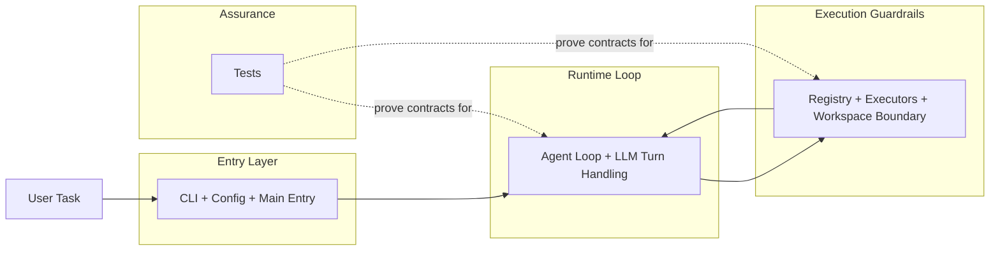
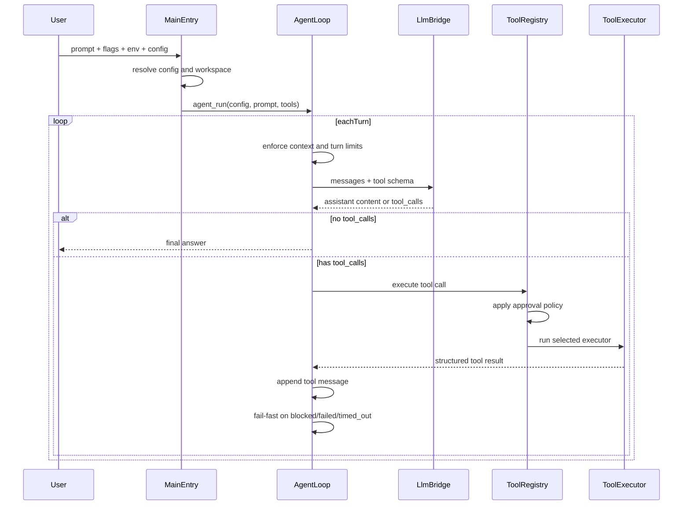

# 概览 (Overview)

这章的任务不是列目录，而是先让你在脑子里跑起一次真正的 NanoCodeAgent 任务。

## 1. 为什么这一章重要？ (Why)
如果你第一次进入这个仓库，最容易迷路的地方不是“文件太多”，而是系统看起来像同时在做很多事：CLI、配置、workspace、HTTP streaming、tool calls、tool registry、bash、安全边界、测试、文档自动化。把这些名词逐个看一遍，并不会自然拼成一个系统。

NanoCodeAgent 真正要解决的问题其实更具体：给它一个任务后，runtime 如何在本地把这件事安全地跑完，而且在需要调用工具时仍然保持可控、可停、可验证。理解了这条主线，后面的章节才不会变成零散模块说明。

## 2. 整体图景 (Big Picture)
先把 NanoCodeAgent 想成一个受约束的本地执行宿主，而不是一个“什么都能做”的自由代理。模型负责提出下一步要说什么、要调用什么工具；宿主负责决定这些请求在当前策略下能不能执行、能执行到什么程度，以及什么时候必须停下来。

从代码结构上看，这条主线大致分成三层：

- 入口层：`src/config.cpp`、`src/cli.cpp`、`src/main.cpp` 把这次运行的条件固定下来。
- 执行层：`src/llm.cpp`、`src/tool_call_assembler.cpp`、`src/agent_loop.cpp` 把模型响应变成一轮轮可消费的 assistant turn。
- 约束层：`src/tool_registry.cpp`、`src/workspace.cpp`、各类工具 executor 和 `tests/` 把“能不能执行、最多执行到哪里、失败后怎么办”钉死成行为合同。

系统总览图如下。这张图现在只负责回答“运行时由哪些层组成、它们大致如何衔接”，不再同时承担完整任务流说明；真正的主任务推进顺序留给下一张图。

这张图现在只展示系统地图：任务先进入入口层，再进入 runtime，再受执行边界约束，最后由测试层证明这些行为合同成立。它**不展开** `LLM bridge`、`Tool Call Assembler`、工具分类或 approval 细节；这些细节分别在 [HTTP 与 LLM 流式解析](03-http-llm-streaming.md)、[工具与安全边界](04-tools-and-safety.md) 和 [测试策略](05-testing.md) 里展开。这样第一张图先给读者地图，而不是把实现细节提前塞进总览。

## 3. 主流程 (Main Flow)
一个任务进入系统后，不是直接“交给模型然后等结果”，而是会先经过一连串前置固定动作。

`src/main.cpp` 先调用 `config_init()` 和 `cli_parse()`，把默认值、配置文件、环境变量和命令行覆盖关系整理成一份最终配置。接着它创建并规范化 workspace，生成 system prompt 和工具 schema，然后才选择 real 或 mock 模式进入 `agent_run()`。

进入 `agent_run()` 后，系统会维护一份 `messages` 历史。每一轮开始前，它先检查最大轮数和上下文大小；随后把消息历史交给 LLM 层。真实网络模式下，`src/llm.cpp` 会发起 streaming 请求，把 SSE 事件里的内容增量拼成 assistant 文本，把碎片化的 `tool_calls` 交给 `src/tool_call_assembler.cpp` 拼完整，最后返回一条已经物化好的 assistant message。

如果这一轮 assistant 没有请求工具，agent loop 就把最终回答输出并结束。如果 assistant 返回了 `tool_calls`，`src/agent_loop.cpp` 会顺序解析和执行这些调用。真正的执行入口是 `ToolRegistry`: 模型可以请求工具，但宿主是否允许执行，要看工具类别和当前配置。只读工具默认可用；变更工具和执行工具默认会被挡住，除非明确打开相应策略。

主流程图如下：

## 4. 一个任务是怎么跑完的？ (Worked Example)
假设你给 NanoCodeAgent 一个很典型的任务：`summarize src/main.cpp`。

在默认配置下，runtime 首先会把这个任务文本当作 `user` 消息放进历史里。模型收到上下文和工具 schema 之后，很可能先流出一小段自然语言，比如“我先看看入口文件”，同时请求一个只读工具，例如 `read_file_safe {"path":"src/main.cpp"}`。

这时真正决定结果的不是模型“有没有礼貌”，而是宿主的策略与边界：

- `ToolRegistry` 会发现这是只读工具，因此不需要额外批准。
- `read_file_safe()` 会把路径限制在 workspace 内，并返回结构化 JSON 结果。
- `agent_loop` 把这条工具结果追加回消息历史，再进入下一轮。

如果下一轮模型只给出总结文本，运行结束；如果它进一步请求写文件或执行 shell，而对应 approval 开关没有打开，registry 会返回 `blocked`，而 loop 会把这视为污染状态并停止。这个 worked example 的重点，不是“模型多聪明”，而是“宿主如何把模型请求变成可控的本地动作”。

## 5. 模块职责要放在流程里看 (Module Roles)
- `src/config.cpp` 与 `src/cli.cpp`：决定这次运行的真实条件，而不是执行业务逻辑。它们回答的是“这次运行允许什么、上限是多少、模式是什么”。  
- `src/main.cpp`：像装配层，把配置、workspace、system prompt、tool schema 和 LLM 回调装成一套可运行的 runtime。  
- `src/llm.cpp`：把模型 streaming 响应翻译成 runtime 能消费的 assistant message；它不是单纯的网络薄封装。  
- `src/tool_call_assembler.cpp`：负责把碎片化 tool-call 参数拼回完整 JSON，这是流式模式能稳定工作的关键桥梁。  
- `src/tool_registry.cpp`：是策略门。它不负责生成工具请求，只负责判断“当前这个工具在这次运行里能不能被执行”。  
- `src/agent_loop.cpp`：是调度中心。它维护消息历史、控制多轮推进、限制工具数量与上下文膨胀，并在失败时立即停机。  
- `tests/`：不是附属品，而是这些边界的行为合同来源。  

## 6. 作为贡献者，你通常怎么读这本书？ (What You Usually Do)
如果你最关心 runtime 本身，推荐按这条路径阅读：

1. 先读本章，建立“任务如何进入系统并被宿主约束”的整体地图。
2. 再读 [CLI、配置与工作区](02-cli-config-workspace.md)，理解运行条件和路径边界是怎么被固定的。
3. 接着读 [HTTP 与 LLM 流式解析](03-http-llm-streaming.md)，看模型响应如何被变成可消费的 assistant turn。
4. 然后读 [工具与安全边界](04-tools-and-safety.md)，理解 approval、registry、executor 和 fail-fast 是怎么配合的。
5. 最后读 [测试策略](05-testing.md)，看这些边界是如何被证明为真的。

只有当你已经理解了 runtime 主线，再去读 [文档自动化](06-documentation-automation.md) 才最有效。那一章不是在解释 agent 如何执行任务，而是在解释仓库如何维护自己的正式文档质量。

## 7. 边界、误解与项目位置 (Boundaries / Pitfalls)
最常见的误解，是把 NanoCodeAgent 想成“模型直接控制机器”。当前代码更接近另一种结构：模型负责提议，宿主负责决定、执行和刹车。approval policy、workspace boundary、tool output limit、context limit 和 fail-fast 共同构成了这条主线的真实边界。

第二个误解，是把 doc automation 和 runtime 混成同一件事。它们确实都体现了“边界先于自动化”的思想，但 runtime 解决的是任务如何被安全执行，doc automation 解决的是文档如何跟代码事实保持一致。对新读者来说，先把 runtime 跑通，才有资格理解后者为什么重要。

最后要保持克制：当前系统已经具备清晰的本地代理宿主结构，但它并不是一个无限制、无限恢复能力的自治体。很多地方刻意选择了 fail-fast 和明确上限，而不是“尽量继续跑下去”。

## 8. 继续深入 (Dive Deeper)
- [CLI、配置与工作区](02-cli-config-workspace.md)
- [HTTP 与 LLM 流式解析](03-http-llm-streaming.md)
- [工具与安全边界](04-tools-and-safety.md)
- [测试策略](05-testing.md)
- [文档自动化](06-documentation-automation.md)
- [src/main.cpp](../../src/main.cpp)
- [src/agent_loop.cpp](../../src/agent_loop.cpp)
- [src/tool_registry.cpp](../../src/tool_registry.cpp)
- [tests/test_agent_mock_e2e.cpp](../../tests/test_agent_mock_e2e.cpp)
- [tests/test_agent_loop_limits.cpp](../../tests/test_agent_loop_limits.cpp)
