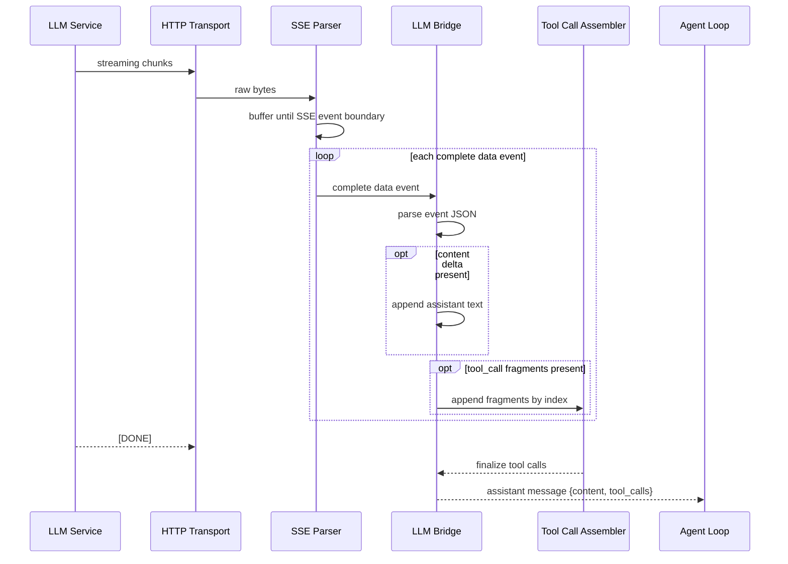

# 大模型网络与流式解析 (HTTP, LLM & Streaming)

这章的核心问题不是“有哪些模块参与了网络层”，而是同一条模型流里，文本增量和 tool-call 参数碎片是如何一路被整理成 agent loop 真正能消费的 assistant turn。

## 1. 为什么这一层重要？ (Why)
如果 NanoCodeAgent 只需要拿到一段完整文本再输出，网络层会简单得多。但代码代理的现实情况不是这样：模型一边生成自然语言，一边还可能提出工具调用；而这些工具调用的参数经常不是一次性给全，而是被拆成很多碎片，甚至和别的输出交错到达。

这就带来一个 runtime 必须解决的问题：系统不能把“正在形成中的意图”误当成“已经完整的调用”。所以这一层真正的价值，不只是流式显示更顺滑，而是把“正在路上的模型输出”安全地翻译成“可以交给下一层决策和执行的结构化消息”。

## 2. 整体图景 (Big Picture)
把这条链路看成一个流水线最容易理解：

- `src/http.cpp` 负责把远端 streaming 响应持续推上来。
- `src/sse_parser.cpp` 负责把原始字节切成完整 SSE event。
- `src/llm.cpp` 负责解释每个 event 的 JSON 含义。
- `src/tool_call_assembler.cpp` 负责把碎片化的 tool-call 参数拼回完整 JSON。
- `src/agent_loop.cpp` 只接收最终整理好的 assistant message，并在那之后再施加每轮/全局工具调用上限。

这条流水线最后产出的不是“还带着网络状态的半成品”，而是一条已经物化好的 assistant message：固定带 `role=assistant`，并按实际情况附带 `content` 和 `tool_calls`。换句话说，这一章讲的不是“HTTP 很重要”，而是“runtime 如何阻止半成品消息越过边界，直接污染后续执行”。

时序图如下。这一处我没有把图拆成“传输解析链”和“tool-call 组装链”两张，因为当前图仍然只回答一个问题：**一条 streaming 响应如何在进入 `agent_loop` 前被整理成完整 assistant message**。它的阅读方向稳定、几乎没有交叉线，而且 tool-call 组装只是这条时间线中的一个分支，而不是另一套并列主问题。

这张图展示的是“流式响应经过传输、事件切分、事件解释和参数组装后，才变成完整 assistant message”的时间顺序。图里把 `content` 增量和 `tool_call` 碎片都画成每个 event 中可独立出现的可选步骤，强调它们可以在同一条流里交错到达，而不是互斥分支。它不展开 HTTP 限额细节，也不展开 `agent_loop` 后续如何审批和执行工具；读法是从上到下沿时间线看每一层接住上一层的产物。

## 3. 主流程 (Main Flow)
真实网络模式下，`src/main.cpp` 会把 `llm_chat_completion_stream()` 作为 agent loop 的 LLM 回调。调用开始时，`src/llm.cpp` 会根据当前配置组装请求 JSON，包括 `model`、`messages`、`stream=true`，以及可选的 `tools` schema；随后它会规范化 `base_url`，在需要时补上 chat completions 接口。

真正发出请求的是 `src/http.cpp`。这一层使用的是 `libcurl`，不是自建 socket 栈。它的职责很明确：持续接收流式响应，并在传输层施加总超时、连接超时、低速超时、TLS 校验和流大小限制。当前默认的总超时是 `60s`、连接超时是 `10s`、流大小上限是 `100 MB`、低速超时窗口是 `30s`。这说明 transport 的目标不是“尽量把流读完”，而是先保证流不会无限挂住或无限膨胀。

收到 chunk 之后，运行时不会立刻尝试“猜”里面是什么，而是先交给 `SseParser`。`SseParser` 只负责事件边界：把一串断断续续到来的字节拼成完整的 `data:` 事件，识别 `[DONE]` 结束标记，忽略注释行，支持 `\n\n` 与 `\r\n\r\n` 两种边界，并把多行 `data:` 内容用换行拼回一条 payload。它还会限制内部 remainder 缓冲到 `256 KB`，避免在一直等不到事件结束符时无限累积字节。只有事件完整后，`src/llm.cpp` 才会开始解析 JSON。

到这一步，流会分叉成两条路：

- 如果 event 里是 `delta.content`，`llm.cpp` 会通过回调把增量文本往外发出，并在流式请求包装层把它累积进最终的 assistant 文本。
- 如果 event 里是 `delta.tool_calls`，`llm.cpp` 不会直接执行任何工具，而是把碎片交给 `ToolCallAssembler`，等整条流结束后再统一 `finalize()`。组装器会按 `index` 归并碎片，允许不同调用交错到达；对没有合法整数 `index` 的碎片会直接忽略，对“最多 32 个 distinct tool call”和“单次调用最多 `1 MB` 参数缓冲”都设硬上限。

所以 `agent_loop` 实际上永远看不到半截网络状态。它拿到的是一条已经物化完成的 assistant message：可能有 `content`，也可能同时包含完整的 `tool_calls`。这条消息里的 `tool_calls[*].function.arguments` 仍会保持 OpenAI 风格的 JSON 字符串形态，后面的 `agent_loop` 会在真正 dispatch 前再解析一次。如果流里出现 API 错误、坏 JSON、用户主动中止、stream 大小超限、SSE remainder 超限，或者 tool-call 参数最终无法拼成合法 JSON，这一层会直接失败，而不是把模糊状态继续往后传。

## 4. 一个真实例子：半截参数为什么不能提前执行？ (Worked Example)
设想模型在分析仓库入口时，想调用 `read_file_safe` 读取 `src/main.cpp`。在流式模式下，这个调用很可能不是一次性到达的，而更接近下面这样：

1. 第一段 event 告诉系统：有一个 `tool_call index=0`，函数名是 `read_file_safe`。
2. 第二段 event 才开始给参数前半截，比如 `{"path":`.
3. 第三段 event 再补后半截，比如 `"src/main.cpp"}`。
4. 最后才收到完成标记。

如果系统在第二段就执行，就等于拿着半截 JSON 去赌“模型大概想干什么”。当前实现明确不这么做。`tests/test_toolcall_assembler.cpp` 和 `tests/test_stream_robustness.cpp` 验证的正是这类场景：参数可以碎片化、可以交错，但只有在 `finalize()` 真正成功之后，它才会变成可执行的 `ToolCall`。如果参数始终没有闭合，错误会在组装阶段被明确抛出，并带上出错 `index` 与尾部片段，方便定位到底是哪一路 tool call 坏掉了。

这次实现里，组装器的 contract 也更明确了：它不是简单地“把字符串拼起来”。对于 `tool_calls` 内部的局部噪音，它只做不会改变调用语义的最小容错，例如忽略没有合法整数 `index` 的碎片，只接受每个 `index` 的第一份非空 `id` 和函数名，并在必要时给缺失 `id` 的调用补一个 `call_<index>` 回退值。若某条调用始终没有参数片段，最终会落成空对象 `{}`；但真正会影响执行语义的问题，例如参数 JSON 最终不能闭合，仍然必须在 `finalize()` 前被挡住。

这也是为什么 `src/llm.cpp` 和 `src/tool_call_assembler.cpp` 的边界必须分清：前者负责理解 event，后者负责等待“足够完整”。继续往后，`src/agent_loop.cpp` 才会对已经成形的 `tool_calls` 施加 `max_tool_calls_per_turn` 和 `max_total_tool_calls` 之类的运行时闸门；默认值分别是 `8` 和 `50`，也可以通过配置文件、环境变量或命令行覆盖，防止“虽然每个调用都完整，但整体数量已经失控”的情况。

## 5. 模块职责要放在上下文里看 (Module Roles)
- `src/http.cpp`
  负责传输和传输层限制。它知道什么时候流超时、什么时候流太大、什么时候调用方主动要求中止，但它并不理解 SSE 语义，更不会理解 tool call 参数。
- `src/sse_parser.cpp`
  负责把 chunk 切成完整 event。它知道“哪里是一条事件”，负责处理注释、多行 `data:`，同时兼容 `\n\n` 和 `\r\n\r\n` 两种边界，并限制未完成 event 的残余缓冲，但不知道事件里的 JSON 是否合理。
- `src/llm.cpp`
  是真正的桥接层。它把 event 解析成内容增量或 tool-call 碎片，遇到 API 错误、坏 JSON 或用户回调中止时立即失败，并在结束时把通过校验的结果整理成 assistant message。
- `src/tool_call_assembler.cpp`
  负责把同一个 `index` 下的参数字符串累积起来，并在最终阶段统一解析成 JSON。它不只是“拼字符串”，还会支持交错到达的多路调用、限制最多 32 个 distinct tool call、限制单个调用最多 `1 MB` 参数缓冲，并在失败时给出带 `index` 和尾部片段的报错。
- `src/agent_loop.cpp`
  不直接处理原始流。它只消费最终成形的 assistant message，在真正 dispatch 前重新解析 `tool_calls[*].function.arguments`，然后再决定下一轮是否要执行工具；如果同一轮工具过多、累计工具过多，或某个工具执行失败/超时，它会在这一层停下，而不是继续把污染状态带入下一轮。

## 6. 作为贡献者，你通常怎么读这条链路？ (What You Usually Do)
如果你想排查 streaming 行为，最有效的顺序不是从网络开始一路盲读，而是按“哪一层负责什么”来读：

1. 先看 `src/llm.cpp`，确认 assistant message 的最终形状是什么。
2. 再看 `src/sse_parser.cpp`，理解 event 是怎么从碎片流里被切出来的。
3. 然后看 `src/tool_call_assembler.cpp`，确认参数在哪一步才算“完整”。
4. 最后回到 `src/http.cpp` 和相关测试，理解传输层限制和失败模式。

如果你正在定位 streaming bug，对应的测试入口通常是：

- `tests/test_sse_parser.cpp`
- `tests/test_llm_stream.cpp`
- `tests/test_toolcall_assembler.cpp`
- `tests/test_stream_robustness.cpp`
- `tests/test_stream_limits.cpp`
- `tests/test_agent_loop_limits.cpp`

这几组测试并不是重复劳动，它们分别在验证不同的职责边界。

## 7. 常见误解、边界与失败模式 (Boundaries / Pitfalls)
### 误解一：`http.cpp` 负责“理解模型响应”
不是。`src/http.cpp` 负责的是流式传输与限额控制。它不理解 SSE，也不理解 JSON，更不理解工具调用。它只会在“流太大”“网络报错”或“上层明确要求中止”这些 transport 条件下停下来。

### 误解二：`SseParser` 会保证 JSON 合法
也不是。`SseParser` 只负责事件切分和残余缓冲约束。真正的 JSON 解析失败是在 `src/llm.cpp` 里被判定为流处理错误，并按 fail-fast 处理。

### 误解三：`llm.cpp` 已经在执行工具
没有。`src/llm.cpp` 的工作是把模型输出翻译成 assistant message。工具执行发生在后面的 `agent_loop` 和 `ToolRegistry`。

### 误解四：流结束前已经足够接近完整，就可以先跑工具
这正是测试想阻止的事。参数碎片在没有完成前，最多只能算“正在形成中的调用意图”，不能越过边界变成执行动作。

### 误解五：所有坏片段都会在进入 assembler 之前被拒绝
并不会。当前 contract 更细：事件级坏 JSON 会在 `src/llm.cpp` 里立刻失败；但对 `tool_calls` 内部的局部噪音，assembler 只在“不改变调用语义”的范围内做最小容错，例如忽略没有合法 `index` 的碎片。真正决定一条调用能不能进入执行的，仍然是最后的 `finalize()` JSON 解析结果和后续 `agent_loop` 闸门。

### 误解六：只要单个 tool call 能拼出来，runtime 就不会再拦
也不是。组装成功只说明“这条调用终于完整了”；真正进入执行前，`src/agent_loop.cpp` 还会检查每轮工具数量、全局累计工具数量，以及工具执行后的失败/超时污染。

最常见的失败模式也集中在这些边界上：坏 JSON、残余缓冲无限增长、被截断的参数、交错 tool-call、流中断、用户回调主动中止、组装后的工具数量洪泛。当前实现宁愿在这些地方早停，也不愿意把模糊状态继续传给下一层。一个值得刻意记住的分界是：**事件级坏数据要尽快失败，参数级未完成状态可以暂存，但必须在 `finalize()` 前完成闭合**。

## 8. 继续深入 (Dive Deeper)
- [概览](01-overview.md)
- [工具与安全边界](04-tools-and-safety.md)
- [src/main.cpp](../../src/main.cpp)
- [src/http.cpp](../../src/http.cpp)
- [src/llm.cpp](../../src/llm.cpp)
- [src/sse_parser.cpp](../../src/sse_parser.cpp)
- [src/tool_call_assembler.cpp](../../src/tool_call_assembler.cpp)
- [tests/test_sse_parser.cpp](../../tests/test_sse_parser.cpp)
- [tests/test_llm_stream.cpp](../../tests/test_llm_stream.cpp)
- [tests/test_toolcall_assembler.cpp](../../tests/test_toolcall_assembler.cpp)
- [tests/test_stream_robustness.cpp](../../tests/test_stream_robustness.cpp)
- [tests/test_stream_limits.cpp](../../tests/test_stream_limits.cpp)
- [tests/test_agent_loop_limits.cpp](../../tests/test_agent_loop_limits.cpp)
