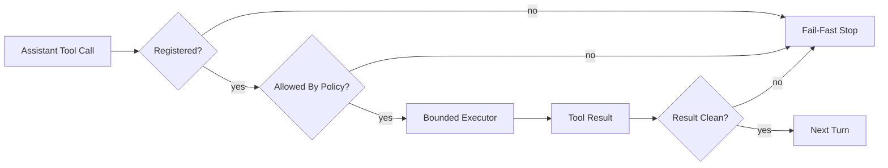

# 工具与安全边界 (Tools & Safety)

这章讲的是 NanoCodeAgent 最关键的一段现实问题：模型提出工具调用之后，宿主机到底凭什么相信它、拦住它，或者在执行后及时停下来。

## 1. 为什么这一层重要？ (Why)
如果没有工具，NanoCodeAgent 只是一个会输出文本的模型客户端。有了工具之后，它才真正变成一个本地代理。但“有了工具”也意味着风险突然变得具体：读文件、写文件、打补丁、跑 shell、构建和测试，都可能把一次错误判断变成真实副作用。

因此这章的核心不是“有哪些工具”，而是“系统如何限制自己”。真正的安全感也不来自一句抽象的“安全沙箱”，而来自一条完整控制链：先注册工具，再按类别决定哪些默认可执行，然后在 executor 里继续施加边界，最后由 agent loop 在失败、超时或失控时收束整轮运行。

## 2. 整体图景 (Big Picture)
这一层可以拆成三道连续闸门：

1. **注册闸门**：系统到底向模型公开了哪些工具、每个工具属于什么类别、接受什么参数。
2. **审批闸门**：就算模型请求了某个工具，当前运行策略是否允许它执行。
3. **执行与停机闸门**：工具真的开始执行后，它是否仍受路径边界、输出上限、超时和 fail-fast 约束。

这三层关系图如下，阅读时只要顺着“请求是否被接住、是否被允许、执行后是否继续”这条控制链往右看：

这张图只展示控制链：请求先确认“系统认不认识这个工具”，再确认“当前策略允不允许它执行”，随后才进入受限 executor，最后由 loop 按结果决定继续还是停机。它没有展开 read-only / mutating / execution 的具体分类细目，也没有展开 executor 内部实现；目的只是帮助读者先抓住边界是如何一层层收紧的。

## 3. 主流程 (Main Flow)
当 `src/agent_loop.cpp` 收到一条带有 `tool_calls` 的 assistant message 后，它会顺序取出每个调用，解析 `function.arguments`，然后交给 `execute_tool()`。真正的统一入口在 `ToolRegistry`。

`ToolRegistry` 会先做两件事：

- 确认工具是否真的被注册过。
- 根据工具类别和当前配置判断它能不能执行。

当前实现把工具分成三类：

- `read_only`
- `mutating`
- `execution`

只读工具注册后会被归一化成无需审批；变更类和执行类默认阻止，只有 `allow_mutating_tools` 或 `allow_execution_tools` 被明确打开时才放行。注意，这里的 approval 不是“人工逐条弹窗确认”，而是运行开始前就确定好的策略门。

一旦通过审批闸门，调用才会进入具体 executor。到这里，不同工具的边界开始分化：

- 文件工具依赖 workspace 解析和 no-follow 打开策略；
- repo 只读工具依赖受限目录、rg/git 参数硬化和输出限制；
- bash/build/test 工具依赖工作目录锁定、环境清理、超时和输出截断。

最后，`agent_loop` 会把工具结果作为 `role=tool` 消息写回上下文。如果结果里出现 `blocked`、`failed`、`ok:false` 或 `timed_out:true` 这类污染信号，loop 会直接停止，而不是继续让模型带着坏状态往下跑。

## 4. 一个真实任务下，工具是如何被允许、被拒绝、然后被停下的？ (Worked Example)
设想用户给系统一个任务：请你读取 `src/main.cpp`，如果需要就修改一点内容并跑一次命令验证。

对 runtime 来说，这不是一个“自由发挥”的请求，而是一连串不同风险级别的动作：

1. 模型先请求 `read_file_safe {"path":"src/main.cpp"}`。  
   这是只读工具，registry 直接放行。

2. 接着模型想请求 `write_file_safe` 或 `apply_patch`。  
   如果本轮没有打开 `allow_mutating_tools`，registry 会直接返回 `blocked`，executor 根本不会被调用。

3. 如果模型进一步请求 `bash_execute_safe` 或 `test_project_safe`，情况更严格。  
   这些都属于执行类工具；如果 `allow_execution_tools` 没打开，它们同样会在 registry 层被挡下。

4. 如果执行类工具被允许，真正的 executor 仍然要再过一层边界。  
   例如 `bash_execute_safe()` 会固定 cwd 到 workspace、清理环境变量、用双管道读输出、在超时或输出失控时杀掉进程组。

5. 只要其中任何一步返回失败、超时或阻止状态，`agent_loop` 就会 fail-fast 停止。  
   这也是为什么“工具被看到”和“工具真的被执行”是两回事。

这个例子想说明的不是“系统特别保守”，而是“工具链路的每一层都在明确回答自己的那一个问题”：可见吗、允许吗、怎么执行、失败后怎么办。

## 5. 模块职责要和控制链一起看 (Module Roles)
- `src/agent_tools.cpp`
  定义默认工具集合，把名称、描述、参数 schema、类别和执行函数绑在一起。这里决定的是“模型能请求什么”。
- `src/tool_registry.cpp`
  是策略门。它决定的是“当前这个请求在本轮运行里能不能执行”。
- `src/read_file.cpp`、`src/write_file.cpp`、`src/apply_patch.cpp`
  是文件边界的第一线。它们不是泛泛检查字符串，而是结合 workspace 解析和安全打开策略来防越界与 symlink 穿透。
- `src/repo_tools.cpp`
  是只读观察面的 executor。它们也需要硬化，因为底层仍然会调用 rg 或 git。
- `src/bash_tool.cpp` 与 `src/build_test_tools.cpp`
  是执行面。这里不承担“绝对隔离”的承诺，而承担“有限执行、及时收束、尽量不泄漏”的承诺。
- `src/agent_loop.cpp`
  是最后一道停机闸门。它用工具数、轮数、上下文和 fail-fast 规则防止错误继续扩散。

## 6. 作为贡献者，你通常怎么理解当前工具面？ (What You Usually Do)
如果你是第一次想看清这套工具系统，最有效的顺序通常不是从工具名开始背，而是从“哪一层在回答哪个问题”开始：

1. 先看 `build_default_tool_registry()` 和 `get_agent_tools_schema()`，确认模型能看到哪些类别的工具。
2. 再看 `src/tool_registry.cpp`，确认默认策略如何区分只读、变更和执行。
3. 然后看具体 executor，理解每类工具的真实风险差异。
4. 最后回到 `src/agent_loop.cpp`，看系统在工具失败后如何停下。

如果你正在改某一条边界，最相关的测试入口通常是：

- approval 语义：`tests/test_tool_registry.cpp`
- 执行类工具副作用与参数容错：`tests/test_schema_and_args_tolerance.cpp`
- bash 边界：`tests/test_bash_tool.cpp`
- loop 停机条件：`tests/test_agent_loop_limits.cpp`

## 7. 常见误解与失败模式 (Boundaries / Pitfalls)
### 误解一：只要工具 schema 暴露给模型，就说明这个工具能执行
不对。schema 暴露的是“模型知道它存在”，真正能否执行要看 `ToolRegistry` 和当前配置策略。

### 误解二：approval 是人工逐条审批
也不对。当前实现里的 approval 是运行前确定的策略开关，不是交互式确认流程。

### 误解三：`bash_execute_safe()` 相当于容器或系统级沙箱
这正是最需要纠正的过度安全表述。当前实现会锁定 workspace、清理环境、限制输出、设置超时并 kill 进程组，但它不是 `chroot`、不是 seccomp，也不是容器。

### 误解四：文件工具和 bash 工具有差不多的边界强度
不是。当前最强的路径边界主要在文件工具，而不是 bash。文件工具在 workspace 解析和安全打开上更严格；bash 更像“受限执行器”，不是“绝对隔离器”。

### 误解五：agent loop 会智能理解“这轮已经没意义了”
当前实现没有那种语义层面的智能裁决。它主要依靠固定阈值和结果状态字符串来 fail-fast。这种做法很朴素，但优点是边界明确。

最常见的失败模式也恰好对应这些误解：默认应阻止的工具被放行、shell 输出失控、后台进程泄漏、工具失败后 loop 继续跑、读写路径被越界利用。正因为这些问题具体而危险，这章才必须把“安全”拆回控制链，而不是抽象口号。

## 8. 继续深入 (Dive Deeper)
- [概览](01-overview.md)
- [HTTP 与 LLM 流式解析](03-http-llm-streaming.md)
- [测试策略](05-testing.md)
- [src/agent_tools.cpp](../../src/agent_tools.cpp)
- [src/tool_registry.cpp](../../src/tool_registry.cpp)
- [src/read_file.cpp](../../src/read_file.cpp)
- [src/write_file.cpp](../../src/write_file.cpp)
- [src/bash_tool.cpp](../../src/bash_tool.cpp)
- [src/agent_loop.cpp](../../src/agent_loop.cpp)
- [tests/test_tool_registry.cpp](../../tests/test_tool_registry.cpp)
- [tests/test_bash_tool.cpp](../../tests/test_bash_tool.cpp)
- [tests/test_agent_loop_limits.cpp](../../tests/test_agent_loop_limits.cpp)
