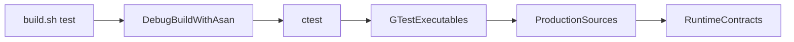
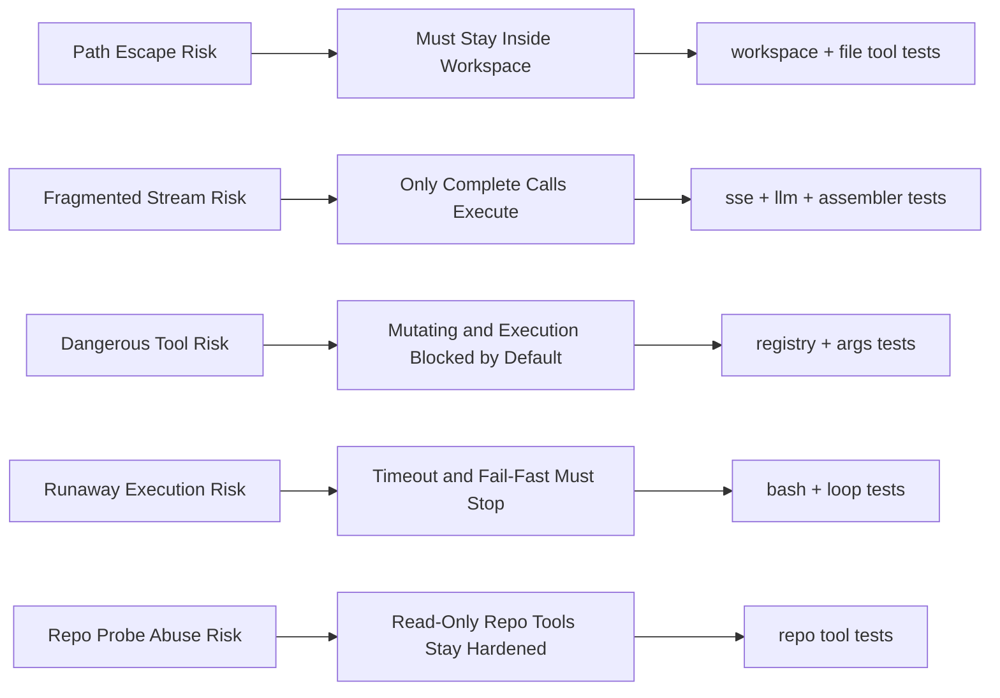
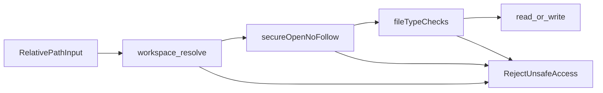

# 测试策略 (Testing)

这章讲的不是“仓库里有哪些测试文件”，而是 NanoCodeAgent 如何用测试证明自己真的守住了边界。

## 1. 为什么这一章重要？ (Why)
NanoCodeAgent 最危险的失败方式，往往不是输出了一句不够聪明的话，而是把错误决策落成了真实副作用：读到了 workspace 外的文件、把半截 tool call 当成完整调用执行了、把默认应阻止的执行工具放过去了，或者在工具失败后还继续循环。

所以这个项目里的测试，核心目的不是展示“功能很全”，而是证明 runtime 的几条关键承诺是真的：

- 路径边界不会轻易被绕过。
- 流式响应不会把碎片化数据误当成完整指令。
- approval policy 会在该阻止的时候阻止。
- 执行工具会在超时、输出失控和环境污染风险下及时收束。
- agent loop 在该停的时候真的会停。

如果把这些行为看成 runtime 的合同，`tests/` 就是在持续检查合同是否还成立。

## 2. 整体图景 (Big Picture)
从运行方式看，测试并不是“单独的一套假系统”。`CMakeLists.txt` 会把生产源码直接编进测试目标，`tests/CMakeLists.txt` 再通过多个 `gtest` 可执行文件把这些边界拆开验证。因此它们测到的是和正式 runtime 同一批实现，而不是另一份专门为测试写的替身逻辑。

日常入口也很明确：`./build.sh test` 先做 Debug 构建，再进入 `build/` 里跑 `ctest --output-on-failure`。Debug 构建默认开启 AddressSanitizer，因此这里检查的不只是业务行为，也包括更底层的内存与资源问题。

如果把这一套过程看成“信任链”，它更像下面这样：



这条链说明的不是“测试很多”，而是“你运行测试时，实际上是在让一批直接链接生产源码的可执行文件重复验证 runtime 合同”。

从风险视角看，测试大致覆盖六条防线：

- workspace 边界
- streaming 与 tool-call 组装
- approval 边界
- 执行工具约束
- agent loop 停机条件
- 只读 repo 观察工具的硬化

风险覆盖图如下，按“风险面 -> 行为合同 -> 代表测试簇”的顺序阅读：



这张图展示的是测试为什么存在：每一列都从“最怕什么失控”走到“系统必须守住什么合同”，最后落到“哪组测试在替这条合同说话”。它没有列出所有测试文件名，也不打算替代正文中的细节清单；目的只是先让读者看懂测试覆盖的逻辑，而不是把 `tests/` 当成索引表去背。

## 3. 主流程：这些测试是怎么运行到真实代码上的？ (Main Flow)
`./build.sh test` 做的事情并不复杂，但很关键。它先执行 Debug 构建，再由 `ctest` 调度所有注册过的测试目标。由于 `tests/CMakeLists.txt` 把 `src/cli.cpp`、`src/config.cpp`、`src/workspace.cpp`、`src/http.cpp`、`src/llm.cpp`、`src/tool_registry.cpp`、`src/agent_loop.cpp` 等源码直接编进测试可执行文件，所以每个测试都在碰真实实现。

这意味着测试的价值不只是“跑通接口”。它们真正验证的是：

- 入口层的覆盖关系和 workspace 初始化是否按预期工作；
- LLM 层对 SSE chunk、坏 JSON、碎片化 tool call 的处理是否足够稳；
- ToolRegistry 的类别门禁是否会在默认情况下挡住危险工具；
- bash/build/test 这类执行面是否真的能在超时、输出爆炸和环境泄漏下收束；
- agent loop 是否会在上限、失败或污染状态出现后中止。

换句话说，测试不是在 runtime 外面看热闹，而是在 runtime 里面反复试探那些最容易出事故的地方。

## 4. 一个更能建立信任的例子：symlink 越界为什么没有绕过去？ (Worked Example)
如果要选一个最能体现“测试在证明边界”而不是“测试在炫数量”的例子，我会选文件边界。

设想这样一个坏场景：workspace 里有一个看似普通的相对路径 `nested/link`，但它其实是一个指向系统敏感文件的 symlink；或者有一个 `linked_dir`，看起来像 workspace 里的目录，实际上却指到别处。如果读写工具只是做字符串级检查，这种路径很容易骗过系统。

对应测试正是在验证 NanoCodeAgent 不会被这种“看起来在里面、实际上通向外面”的路径绕过去：

- `tests/test_workspace.cpp` 先验证基础路径解析：绝对路径和 `..` 逃逸都要被拒绝。
- `tests/test_read_file.cpp` 验证读文件时，目标 symlink 和中间目录 symlink 都不能穿透，而且 FIFO、二进制内容也不能被当普通文本处理。
- `tests/test_write_file.cpp` 验证写文件时，同样不能借 symlink 把写入落到预期之外的位置。

这条信任链可以概括成：



这些测试真正建立的信任是：NanoCodeAgent 对文件边界的判断不是“看起来像在 workspace 里就算数”，而是经过路径解析、安全打开和文件类型检查之后，才允许真正读写。

Streaming 相关测试同样重要，但它们更适合在 [HTTP 与 LLM 流式解析](03-http-llm-streaming.md) 那一章里展开；本章更想强调的是“测试如何把 runtime 承诺一条条钉死”。

## 5. 模块职责要和风险绑定来看 (Module Roles)
- `tests/test_workspace.cpp`、`tests/test_read_file.cpp`、`tests/test_write_file.cpp`
  证明路径不能绝对化、不能用 `..` 逃逸、不能借 symlink 穿透，也不能把 FIFO 或二进制内容当普通文本处理。
- `tests/test_sse_parser.cpp`、`tests/test_llm_stream.cpp`、`tests/test_toolcall_assembler.cpp`、`tests/test_stream_robustness.cpp`
  证明 streaming 路径里的每一层只负责自己的那一段：事件切分、JSON 解析、参数拼装、最终交付。
- `tests/test_tool_registry.cpp`、`tests/test_schema_and_args_tolerance.cpp`
  证明 approval 是运行策略门，而不是写在文档里的礼貌约定。只读工具默认放行，变更类和执行类默认阻止。
- `tests/test_bash_tool.cpp`、`tests/test_build_test_tools.cpp`
  证明执行工具不是“随便起个子进程”。超时、输出上限、环境清理、后台进程清理和结构化失败结果都被钉住了。
- `tests/test_agent_loop_limits.cpp`、`tests/test_agent_mock_e2e.cpp`
  证明 agent loop 不是无限循环的 orchestrator，而是知道何时停、何时 fail-fast、何时丢弃旧工具输出以收缩上下文的 broker。
- `tests/test_repo_tools.cpp`
  证明“只读观察工具”也需要硬化，因为它们底层仍会调用 git 或 rg；如果不加约束，也可能变相绕成执行面。

## 6. 作为贡献者，你通常怎么用这些测试？ (What You Usually Do)
最常见的入口就是：

```bash
./build.sh test
```

如果你刚改的是某条边界规则，读测试的顺序通常比盲跑全部测试更重要：

1. 改 workspace / 文件工具时，先看 `test_workspace`、`test_read_file`、`test_write_file`。
2. 改 streaming / tool call 时，先看 `test_sse_parser`、`test_llm_stream`、`test_toolcall_assembler`、`test_stream_robustness`。
3. 改 approval / registry 时，先看 `test_tool_registry`。
4. 改执行工具时，先看 `test_bash_tool`、`test_build_test_tools`。
5. 改 loop 行为时，先看 `test_agent_loop_limits` 和 `test_agent_mock_e2e`。

这种阅读方式的好处是：你不是在“找某个测试文件”，而是在先问“我碰的是哪条边界”，再去看哪组测试在替这条边界说话。

## 7. 常见误解与失败模式 (Boundaries / Pitfalls)
最常见的误解，是把测试理解成“证明功能可用”。在这个项目里，很多测试更重要的作用是证明某种坏事不会发生。例如：

- 不会把 workspace 外的路径当成内部路径。
- 不会把半截 tool-call 参数当成完整调用。
- 不会因为工具默认可见就默认可执行。
- 不会在工具失败后继续让 agent loop 带着污染状态往下跑。

另一个误解，是把“测试很多”当成“系统一定安全”。测试能证明的，是当前明确写下来的行为合同；它们不能替代对边界的克制描述，也不能把一个受限执行器吹成容器级隔离。对 NanoCodeAgent 来说，测试提升的是可信度，而不是神话色彩。

最后要注意，这一章里最值得读者带走的，不是某个测试名字，而是一个习惯：每当你想给 runtime 加一条新能力时，也应该同时问一句，“这条能力最怕哪种失控方式，我要用哪类测试把它钉住？”

## 8. 继续深入 (Dive Deeper)
- [概览](01-overview.md)
- [HTTP 与 LLM 流式解析](03-http-llm-streaming.md)
- [工具与安全边界](04-tools-and-safety.md)
- [build.sh](../../build.sh)
- [CMakeLists.txt](../../CMakeLists.txt)
- [tests/CMakeLists.txt](../../tests/CMakeLists.txt)
- [tests/test_workspace.cpp](../../tests/test_workspace.cpp)
- [tests/test_read_file.cpp](../../tests/test_read_file.cpp)
- [tests/test_write_file.cpp](../../tests/test_write_file.cpp)
- [tests/test_tool_registry.cpp](../../tests/test_tool_registry.cpp)
- [tests/test_bash_tool.cpp](../../tests/test_bash_tool.cpp)
- [tests/test_agent_loop_limits.cpp](../../tests/test_agent_loop_limits.cpp)
- [tests/test_stream_robustness.cpp](../../tests/test_stream_robustness.cpp)
