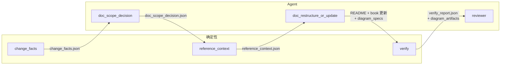

# Docgen E2E 数据流程图（固定目标文档集）

入口：`bash scripts/docgen/run_docgen_e2e.sh`（可选 `REF=HEAD~1` 或 `REF=main`）。  
所有生成物均在 `docs/generated/` 下。

---

## 旧设计为何错误

原先的设计把「根据 git diff 扫描全仓可能相关的 markdown」当成核心：通过同目录、上一级目录、整个 docs/ 得到 adjacent docs 和 candidate docs（README + docs/* + book/src/*），再由 AI 对「全仓候选文档」做 required/optional 分类。这与真实产品目标不符：

- **真实目标**是「固定目标文档集的文档自动化更新系统」，目标文档集只有 **README.md** 和 **book/src/**\*.md**。
- examples、tests、templates、源码、CLI help 等应作为 **参考材料（reference context）**，不是待修改目标。
- 「发现目标文档」应由 Agent 做 **目录级决策**（是否改 README、是否改 book、book 下哪些目录），而不是由脚本扫描全仓产出 candidate 列表。

因此已废弃：同目录 markdown、上一级目录 markdown、整个 docs/ 扫描、README + docs + book 的全仓 candidate docs 作为目标发现方式。

---

## 新设计核心边界

- **Target docs（目标文档）**：仅 **README.md** 与 **book/src/**\*.md**。不允许把 docs/*.md、examples、templates 等当作待修改目标。
- **Reference context（参考材料）**：examples、tests、templates、相关源码、CLI help、旧文档片段等仅供 Agent 参考，与 target docs 彻底分离。
- **Agent 主导目录级决策**：是否改文档、改 README/book/both、book 下哪些目录、是否新增/删除/合并/重组，由 Agent 根据 change facts 判断，脚本不产出「待修改文档列表」。
- **确定性脚本**：只做 change facts 提取、reference context 收集、verify（路径/链接/命令/scope 一致性），不接管主流程。

---

## 流程图（Mermaid）

---

## 各阶段一览表

| 阶段 | 调用 | 作用概括 | 本阶段输出 | 职责 |
|------|------|----------|------------|------|
| 1–2b | 读规则、查 skills、查 codex | 前置与准备 | 无 | 确保流程与 Codex 可用 |
| **3** | `change_facts.py --root . --ref REF --output …` | 从 git diff 提取客观事实：变更文件、add/modify/delete/rename、public surface 信号、大规模重构信号 | `docs/generated/change_facts.json` | 仅事实，不发现目标文档 |
| **4** | `codex exec` + `ai_doc_scope_decision.md` | Agent 根据 change_facts 判断：是否改文档、改 README/book、book 下哪些目录、是否目录级新增/删除/重组 | `docs/generated/doc_scope_decision.json` | 目录级决策；目标仅 README + book |
| **5** | `reference_context.py --scope … --facts …` | 在 scope 确定后收集参考材料：examples、tests、templates、源码、旧文档片段（reference only） | `docs/generated/reference_context.json` | 供 Agent 使用，非 target docs |
| **6** | `codex exec` + `ai_doc_restructure_or_update.md` | Agent 按 scope 直接更新 README 与 book 受影响部分；若图示有改动，先写 diagram spec 再写 Mermaid | 直接改 README.md、book/src/*.md；可选 `docs/generated/diagram_specs/...` | 不写 candidates 目录 |
| **7** | `run_verify_report.py --scope …` | 对目标文档做路径/链接/Mermaid render/命令校验，并与 scope 一致 | `docs/generated/verify_report.json`、`docgen_validation_report.md`、可选 `docs/generated/diagram_artifacts/...` | Mermaid render 为 blocking；截图供 visual review |
| **8** | `codex exec` + `ai_review.md` | Agent 审稿：教学逻辑、可读性，以及基于 screenshot 的 diagram visual review | `docs/generated/docgen_review_report.md` | 不重写内容 |
| **9** | `render_docgen_e2e_summary.py` | 从 JSON evidence 确定性写出 E2E 总览与最终建议（无 Codex） | `docs/generated/docgen_e2e_summary.md` | 人类验收入口 |

---

## 脚本与产出路径速查

| 脚本或调用 | 产出路径 |
|------------|----------|
| `change_facts.py` | `docs/generated/change_facts.json` |
| `codex exec`（ai_doc_scope_decision） | `docs/generated/doc_scope_decision.json` |
| `reference_context.py` | `docs/generated/reference_context.json` |
| `codex exec`（ai_doc_restructure_or_update） | 直接改 README.md、book/src/*.md；如有 Mermaid 则额外写 `docs/generated/diagram_specs/...` |
| `run_verify_report.py` | `docs/generated/verify_report.json`、`docgen_validation_report.md`、以及 Mermaid 截图产物引用 |
| `codex exec`（ai_review） | `docs/generated/docgen_review_report.md` |
| `render_docgen_e2e_summary.py` | `docs/generated/docgen_e2e_summary.md` |

任务描述：`scripts/docgen/tasks/ai_doc_scope_decision.md`、`ai_doc_restructure_or_update.md`、`ai_review.md`。Step 9 由 `render_docgen_e2e_summary.py` 完成，无 task 文件。

---

## 闭环模式（verify-repair / review-rework）

**入口**：`bash scripts/docgen/run_docgen_e2e_closed.sh`。先执行 Phase 1（Step 1–6，与 `run_docgen_e2e.sh` 一致），再由 **Python 编排器** `run_docgen_e2e_loop.py` 驱动 Phase 2。

**两条闭环**：

1. **verify-repair**：`run_verify_report.py` 产出 `verify_report.json`（含 `blocking_issues`）。若存在 blocking 且 `verify_repair_count < 2` 且总返工次数未超限，则执行 `ai_verify_repair.md`（只修 blocking，不重写、不扩 scope）→ 再次 verify；通过后进入 review。
2. **review-rework**：审稿产出 `docgen_review_report.md`（可选 `docgen_review_report.json`）。若存在 **Must fix** 且 `review_rework_count < 2` 且总返工未超限，则执行 `ai_review_rework.md`（按 must fix 改文档）→ 再次 verify → 再次 review；无 must fix 或达上限后写 summary。

**状态与重试**：

- 状态持久化到 `docs/generated/e2e_loop_state.json`（`phase`、`verify_repair_count`、`review_rework_count`、`total_repair_actions`、`last_verify_report`、`last_review_report`）。
- 同次 run 的图示证据链会汇总到 `docs/generated/e2e_run_evidence.json`，包括 diagram specs、diagram artifacts、screenshots，以及 review/rework 是否显式引用了这些路径。
- **上限**：verify_repair 最多 2 次，review_rework 最多 2 次，**总返工动作**（repair + rework 次数之和）不超过 4。

**失败类型**：

- **VerifyTerminalFail**：blocking 在 2 次 verify_repair 后仍存在，或总返工达限。
- **ReviewTerminalFail**：must fix 在 2 次 review_rework 后仍存在或总返工达限。
- **PipelineTerminalFail**：缺少 scope/verify_report 等必需中间产物，或状态机异常。

失败时写入 `docs/generated/e2e_failure_report.md`（失败类型、最后一次 verify/review 报告路径），exit 1，保留所有 generated 产物。

**Phase 2 新增/扩展产物**：`verify_report.json` 增强（`blocking_issues` / `non_blocking_issues` 与 Mermaid `artifact_report`）、`verify_repair_report.json`、`review_rework_report.json`、`e2e_loop_state.json`、`e2e_run_evidence.json`、`e2e_failure_report.md`（仅失败时）。

---

## 自检清单（追溯中间结果）

- **阶段 3**：打开 `change_facts.json`，确认有 `changed_files`、`diff_ref`、`public_surface_signals`，且与 `git diff REF` 一致。
- **阶段 4**：打开 `doc_scope_decision.json`，确认 `update_readme`/`update_book`、`book_dirs_or_chapters`、`rationale`；无「全仓 candidate docs」。
- **阶段 5**：打开 `reference_context.json`，确认为 reference only（examples、tests、source_paths、existing_doc_excerpts 等）。
- **阶段 6**：查看 README 与 book/src 下对应文件是否已按 scope 更新。
- **阶段 7**：打开 `verify_report.json`，确认 `blocking_passed`、per-file 结果，以及 Mermaid `artifact_report` 是否指向 `docs/generated/diagram_artifacts/...`。
- **阶段 8–9**：打开 `docgen_review_report.md`、`docgen_e2e_summary.md` 与 `e2e_run_evidence.json`，确认审稿结论、图示证据链和最终建议彼此一致。
