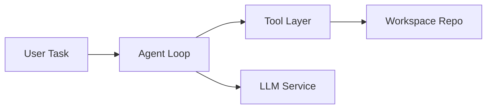
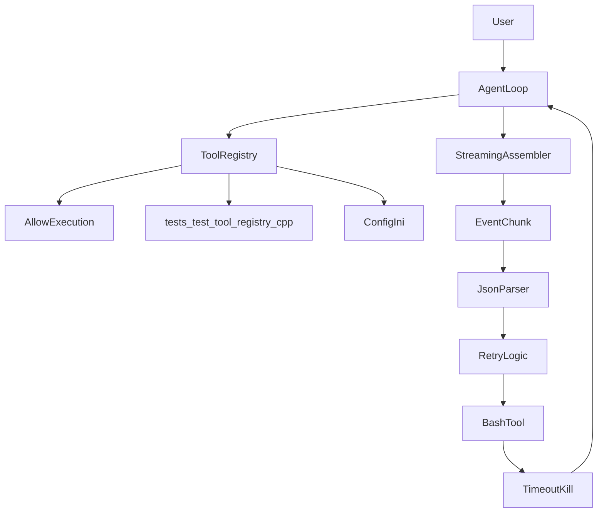
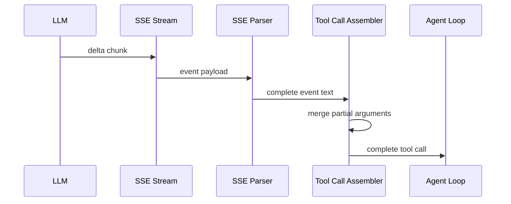
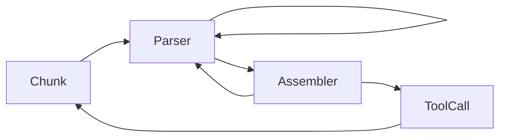
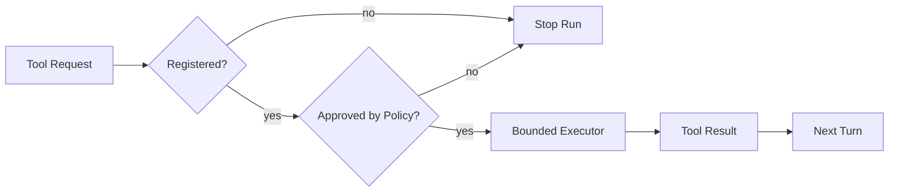
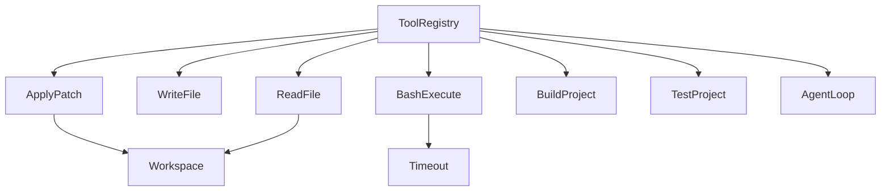
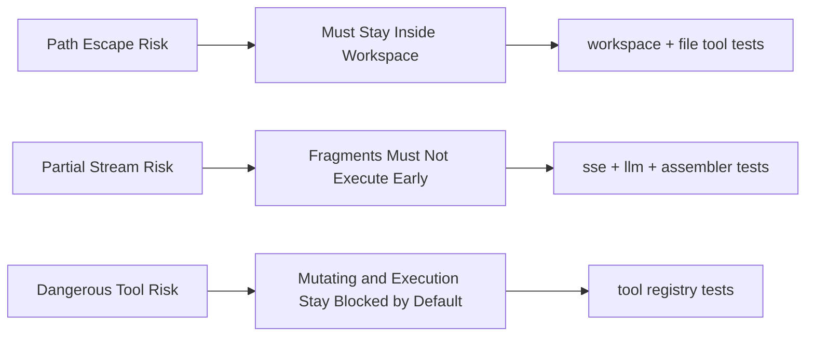
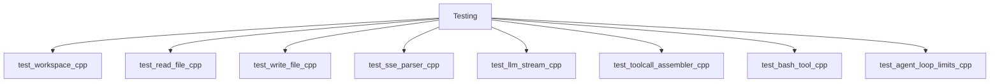

# Diagram Gallery

> 用途：给 `book/src` 这类教学型文档提供 Mermaid 参考范式。  
> 权威规则仍以 `docs/documentation-collaboration-style.md` 为准；本文件负责把规则变成可直接模仿的正反例。  
> 注意：这里的图都是**示意图**，用于展示画法，不代表仓库中的真实实现细节。

## 如何使用

1. 先写 diagram spec：这张图只回答什么问题，明确不展示什么，为什么保留单图或为什么拆图。
2. 再问这张图要帮助读者理解什么：结构、时序、边界，还是覆盖关系。
3. 再选最接近的图型范式，不要把多种主语义塞进同一张图。
4. 不要把节点数量当硬上限；真正的标准是图是否仍然清晰。
5. 当清晰度守不住时，主动拆图，不要继续把更多信息压进一张图。
6. 最后补 caption：说明图展示什么、不展示什么、该怎么读。
7. 进入 review 前，Mermaid 必须先通过真实渲染校验，并产出 screenshot artifact；render fail 不是可读性审美问题，而是 blocking verify 问题。

## 拆图判据

当下列条件满足两条及以上时，应认真考虑拆图；若已经影响主线理解，则应直接拆图：

- 同时在讲结构关系和时间顺序
- 同时在讲主流程和大量边界 / 异常
- 阅读方向无法稳定保持左到右或上到下
- 为了说明白不得不使用很多长标签
- 交叉箭头明显增加
- caption 已经需要解释“这张图分几部分看”
- 图里其实存在多个并列主问题

## 推荐拆图模板

- **Overview / architecture 过重**：
  - 图 1：系统结构图
  - 图 2：主任务流图
- **Streaming 图过重**：
  - 图 1：传输与解析链
  - 图 2：tool-call 组装链
- **Tools / safety 图过重**：
  - 图 1：控制链
  - 图 2：风险分层
- **Testing 图过重**：
  - 图 1：风险面地图
  - 图 2：测试簇与契约映射

## 视觉层提醒

- **big picture 图优先呈现块与关系**，不是先铺实现细节。
- **节点标题尽量短、名词化、可扫读**，不要让节点变成一句总结句。
- **解释句尽量放 caption**，不要把大段说明挂在线上。
- **overview 图首先要像地图**：读者应先认出层、块、主线，再去看章节细节。
- **单图已经成立时不要机械拆图**；图不成立时也不要因为想省 token 而硬留单图。
- **review 要看渲染后的图**：是否拥挤、是否重心不稳、是否中心噪音过多，都应以 screenshot 为准。

## Reviewer 快速 rubric

审图时至少要明确回答这 5 个问题：

1. 这张图是不是只回答一个主问题？
2. 细节有没有下沉到后续章节？
3. 标题是不是短而可扫读？
4. 画面中心有没有噪音？
5. caption 有没有承担解释职责？

如果问题更偏“图型不对、一图多义、该拆未拆”，按 **semantic quality** 记；如果问题更偏“拥挤、长标签、中心噪音、视觉重心差”，按 **visual quality** 记。

## 1. Architecture / Overview

### 好例子：只讲系统主结构

推荐 caption：

> 这张图只展示运行时主链：用户任务进入 agent loop，agent 一边和 LLM 交互，一边通过工具层读写 workspace。图中不展开审批细节和测试覆盖，目的是先建立整体结构地图。

为什么这是好图：

- 主方向单一，读者从左到右就能读完主链。
- 节点名是职责，不是内部类名清单。
- 没把错误分支、测试文件、底层实现细节塞进总览图。
- 如果后续章节会专门解释某个实现细节，overview 图就不应抢先展开它。

### 反例：overview 图混入太多别的语义

为什么这是反例：

- 同时在讲架构、审批、流式解析、测试、失败处理。
- 节点名既有职责名，也有测试文件名和实现细节，读者抓不住主线。
- 箭头回绕后，图不再是“总览”，而像压缩失败的讲稿。

overview 图常见 anti-pattern：

- 把后续章节才会展开的实现细节抢先压进第一张图。
- 在线条上挂解释句，导致读者先读文案而不是看结构。
- 用很多细碎容器制造“复杂感”，却没有换来更清楚的层次。
- 中心位置被异常分支、备注块或实现名词占满，主线反而退到边缘。

更成熟的改法：

- 把“系统结构”留在 overview 图。
- 把“任务如何穿过系统”拆到单独的主流程图。
- 把 `assembler`、approval、测试覆盖等下沉到对应章节图，不抢第一张系统地图的职责。

## 2. Sequence / Streaming

### 好例子：只讲事件顺序

推荐 caption：

> 这张图只展示流式响应被逐层组装成完整 tool call 的时序。它不解释各模块的全部职责，也不展开失败恢复分支；读法是从上到下看每一层如何接住上一层的输出。

为什么这是好图：

- `sequenceDiagram` 天然匹配“先发生什么，再发生什么”。
- 每一层只出现一次，读者不会误把依赖关系看成时序关系。
- caption 明确了图的边界。

### 反例：用 flowchart 硬讲时序

为什么这是反例：

- 箭头既像调用又像时间推进，读者不知道该怎么读。
- 自环和回环太多，时序主线被冲淡。
- 更适合改成 `sequenceDiagram`。

更成熟的改法：

- 如果单一时序图仍能稳定表达，就保留一张 `sequenceDiagram`。
- 如果同一图还要解释参数组装细节，再拆成“传输解析链”与“tool-call 组装链”两张图。

什么时候该把细节下沉到下一章：

- 如果当前 sequence 图开始解释模块分类、审批策略或测试覆盖，说明这些内容已经不属于本图主问题，应下沉。
- 如果 overview 图里出现了后续章节才会专门解释的内部桥接层或实现名词，应把它们移出 overview，只在对应章节图中展开。

## 3. Boundary / Approval

### 好例子：只讲闸门与去向

推荐 caption：

> 这张图展示工具调用必须连续通过“已注册、被策略允许、在受限 executor 中执行”三道闸门。它不展开每类 executor 的内部实现，目的是帮助读者理解边界控制链而不是记实现细节。

为什么这是好图：

- 主语义非常明确：允许 / 阻止 / 继续。
- 判断节点和结果节点职责分明。
- 没把“工具分类清单”和“运行时全景图”混在一起。

### 反例：边界图退化成工具清单

为什么这是反例：

- 看起来像在列工具，而不是在解释边界。
- 读者很难回答“到底哪里被阻止，哪里继续执行”。
- 如果正文在讲审批链，这张图就选错图型了。

更成熟的改法：

- 先画“注册 / 审批 / 执行 / 停机”的控制链。
- 如果还想解释工具风险差异，再单独补一张风险分层图。

## 4. Coverage / Testing

### 好例子：从风险面连到合同，再连到代表测试簇

推荐 caption：

> 这张图展示的是“风险面 -> 行为合同 -> 代表测试簇”的覆盖关系。它不列出所有测试文件名，目的是让读者理解测试在证明什么，而不是只看到测试目录索引。

为什么这是好图：

- 读者先看到风险，再看到合同，再看到测试簇，逻辑顺序自然。
- 测试节点保持簇级别，避免图退化成文件名墙。
- 每列职责清楚，适合教学型“可信性说明”。

### 反例：coverage 图画成文件索引

为什么这是反例：

- 读者只会知道“测试很多”，但不知道它们在证明什么。
- 缺少风险面和行为合同，无法形成理解上的桥梁。
- 这种信息更适合放正文列表，不适合当教学图。

更成熟的改法：

- 先画风险面与行为合同。
- 如果需要，再另画测试簇与契约映射，而不是在一张图里塞完整目录。

## 5. Caption 公式

每张图后至少回答这三件事：

- **展示什么**：这张图的主语义是什么。
- **不展示什么**：哪些实现细节、异常分支或补充材料没有画进去。
- **如何阅读**：从左到右、从上到下，还是按阶段 / 泳道阅读。

可直接套用的句式：

> 这张图展示 `<主语义>`。它不展开 `<刻意省略的细节>`，目的是帮助读者先建立 `<结构 / 流程 / 边界 / 覆盖>` 的整体理解。阅读时按 `<方向或分组>` 看主线即可。

## 6. Reviewer 快速追问

审图时可以快速问自己：

- 这张图是不是一眼就能说出“它在讲什么”？
- 如果把正文删掉一半，图还能不能保住主线？
- 图里的箭头到底表示时间、依赖、审批，还是覆盖？有没有混淆？
- 这张图是不是在增加理解，而不是把正文换成方框？
- 这张图现在是“应该重排一下”，还是其实已经该拆成两张？
